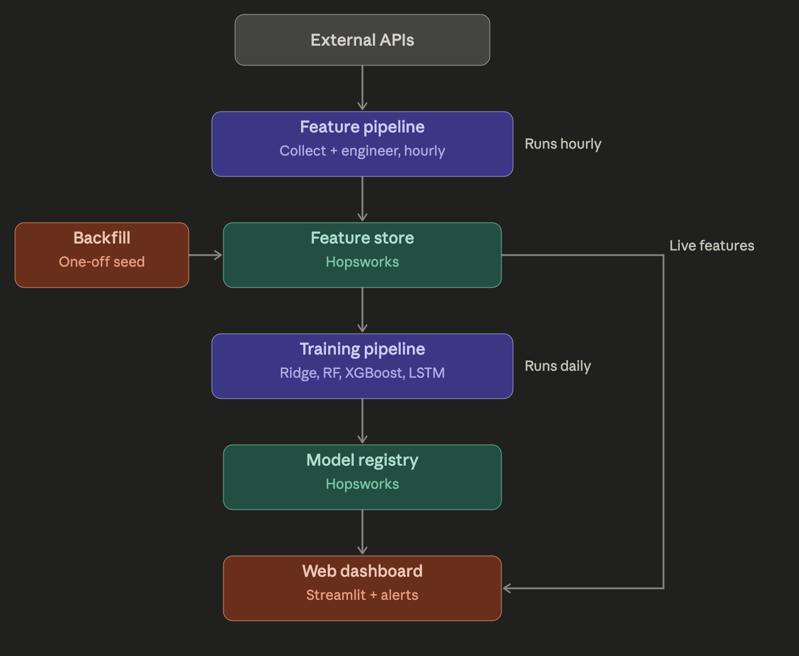
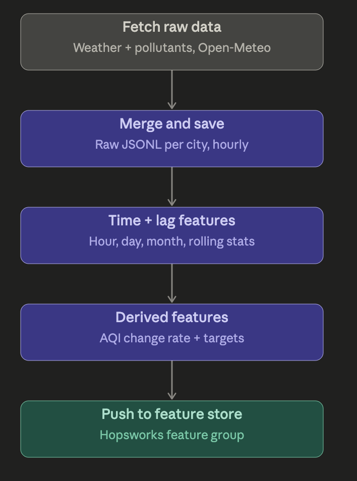
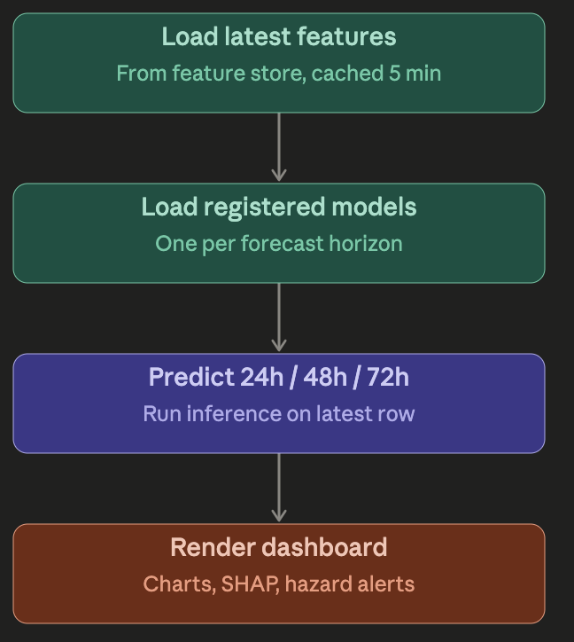
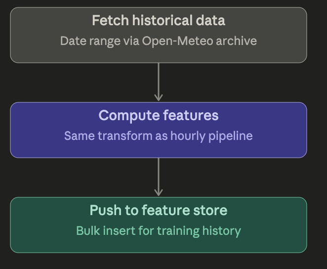
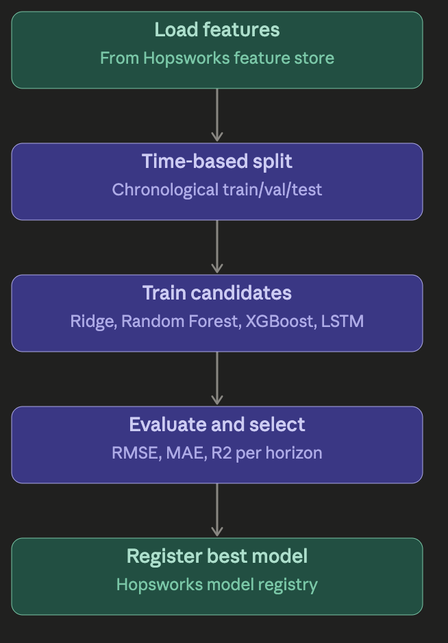
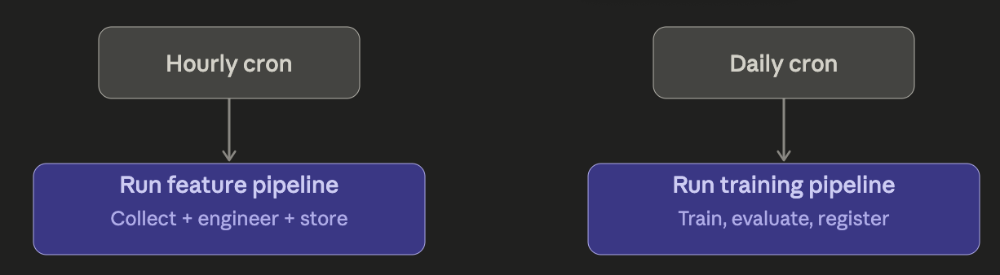

# AQI Prediction Pipeline

  

  <em>Figure 1: End-to-End AQI Prediction Pipeline</em>

# Feature Pipeline

  

  <em>Figure 2: Feature Pipeline</em>

# Serving Pipeline

  

  <em>Figure 3: Serving Pipeline</em>

# Backfill Pipeline

  

  <em>Figure 4: Backfill Pipeline</em>

# Training Pipeline

  

  <em>Figure 5: Training Pipeline</em>

# CI/CD Orchesteration Pipeline

  

  <em>Figure 6: CI/CD Orchesteration Pipeline</em>

